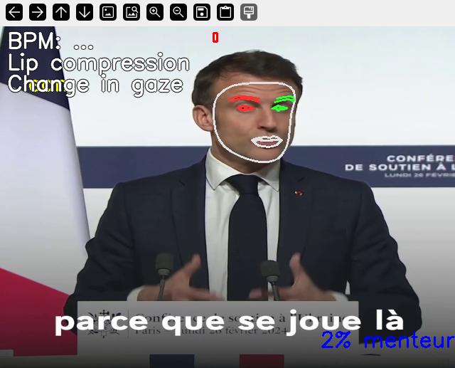

# DetecteurFun

**DetecteurFun** est un détecteur de mensonge ludique inspiré du projet [Truthsayer](https://github.com/everythingishacked/Truthsayer). Il analyse une vidéo pour détecter des indices physiologiques et comportementaux comme le pouls, les clignements d’yeux, les mains sur le visage, les changements de regard, et la compression des lèvres. Le programme affiche un pourcentage de "mensonge", des repères faciaux visuels, et un indicateur graphique ("truth meter") pour une expérience immersive.

Ce projet utilise des techniques de vision par ordinateur avec MediaPipe et OpenCV, et est conçu pour être simple à utiliser tout en offrant des résultats proches de Truthsayer. Idéal pour s’amuser, expérimenter, ou apprendre sur la détection de signaux physiologiques !

## Fonctionnalités

- **Détection du pouls** : Mesure le pouls (battements par minute) via rPPG sur les joues (canaux vert/rouge).
- **Clignements d’yeux** : Identifie les clignements et détecte des changements significatifs ("Increased/Decreased blinking").
- **Mains sur le visage** : Signale quand une main touche le visage ("Hand covering face").
- **Changements de regard** : Détecte les mouvements brusques du regard ("Change in gaze").
- **Compression des lèvres** : Repère les lèvres pincées ("Lip compression").
- **Pourcentage de "mensonge"** : Calcule un score (0-80%) basé sur les indices détectés, affiché comme "XX% menteur".
- **Repères faciaux** : Affiche un maillage visuel des contours du visage et des iris avec MediaPipe.
- **Truth Meter** : Indicateur graphique qui grandit selon le nombre d’indices détectés.
- **Interface épurée** : Pas de questions interactives, focus sur l’analyse vidéo.
- **Calibration** : 120 frames pour établir une base fiable avant d’afficher les résultats.

## Démo



*(Ajoute une capture d’écran en suivant les instructions dans "Contribuer" pour montrer le résultat !)*

## Prérequis

- **Python** : Version 3.8 ou supérieure.
- **Système** : Testé sur Ubuntu/Linux, mais compatible avec Windows/Mac avec les bonnes dépendances.
- **Vidéo MP4** : Une vidéo avec un visage bien éclairé (ex. : `test.mp4`) pour l’analyse.
- **Matériel** : CPU standard, pas besoin de GPU (mais une bonne caméra/lumière améliore la détection).

## Installation

1. **Cloner le dépôt** :
   ```bash
   git clone https://github.com/ton-utilisateur/DetecteurFun.git
   cd DetecteurFun
   ```
   *Remplace `ton-utilisateur` par ton nom d’utilisateur GitHub et `DetecteurFun` par le nom de ton dépôt.*

2. **Créer un environnement virtuel** :
   ```bash
   python3 -m venv venv
   source venv/bin/activate  # Sur Windows : venv\Scripts\activate
   ```

3. **Installer les dépendances** :
   ```bash
   pip install -r requirements.txt
   ```

4. **Ajouter une vidéo** :
   - Place une vidéo MP4 (ex. : `test.mp4`) dans le dossier `DetecteurFun`.
   - Modifie `detecteur_simplifie.py` si ta vidéo a un autre nom :
     ```python
     cap = cv2.VideoCapture("ta_video.mp4")
     ```

## Utilisation

1. **Lancer le programme** :
   ```bash
   python detecteur_simplifie.py
   ```

2. **Observer les résultats** :
   - Une fenêtre s’ouvre avec la vidéo analysée.
   - **Repères faciaux** : Points/lignes sur le visage (contours, iris).
   - **Pouls** : Ex. : "BPM: 75" (haut gauche).
   - **Indices** : Ex. : "Heart rate increasing", "Lip compression" (gauche).
   - **Pourcentage** : Ex. : "30% menteur" (bas droite).
   - **Truth Meter** : Rectangle rouge qui grandit avec les indices.
   - **Messages** : "Clean", "Suspect", "Lying", "Big Lie!" selon le score.
   - Appuie sur `q` pour quitter.

3. **Personnaliser (optionnel)** :
   - Change les seuils dans le code (ex. : `EYE_BLINK_HEIGHT`, `LIP_COMPRESSION_RATIO`).
   - Active l’enregistrement en décommentant les lignes `out = ...` pour sauvegarder `output.mp4`.

## Dépendances

Liste des bibliothèques nécessaires (incluses dans `requirements.txt`) :
- `opencv-python` : Traitement vidéo et affichage.
- `numpy` : Calculs numériques.
- `mediapipe` : Détection faciale et mains.
- `scipy` : Analyse du signal pour le pouls.

Pour installer manuellement :
```bash
pip install opencv-python numpy mediapipe scipy
```

## Exemple

1. Place une vidéo `interview.mp4` dans `DetecteurFun`.
2. Modifie `detecteur.py` :
   ```python
   cap = cv2.VideoCapture("interview.mp4")
   ```
3. Lance :
   ```bash
   python detecteur_simplifie.py
   ```
4. Résultat attendu :
   - Vidéo avec des repères faciaux.
   - Pouls affiché (ex. : "BPM: 72").
   - Indices comme "Increased blinking" si la personne cligne beaucoup.
   - Pourcentage (ex. : "40% menteur") qui grimpe avec les indices.
   - Truth meter qui s’agrandit si plusieurs indices sont détectés.

## Limites

- **Qualité vidéo** : Nécessite un bon éclairage et un visage visible pour des résultats précis.
- **Performance** : Peut être lent sur des vidéos HD ou des machines peu puissantes (réduis la résolution dans le code si besoin).
- **Ludique** : Pas un vrai détecteur de mensonge, juste pour s’amuser !
- **Pas d’humeur** : Exclut `fer` pour éviter les dépendances lourdes (peut être ajouté si voulu).


## Crédits

- **Inspiration** : [Truthsayer](https://github.com/everythingishacked/Truthsayer) par everythingishacked.
- **Bibliothèques** : MediaPipe, OpenCV, NumPy, SciPy.
- **Auteur** : Massinissa
Un grand merci à la communauté open-source pour les outils incroyables utilisés ici !

## Licence

Ce projet est sous [MIT License](LICENSE). Tu es libre d’utiliser, modifier, et partager le code, tant que tu respectes les termes de la licence.
